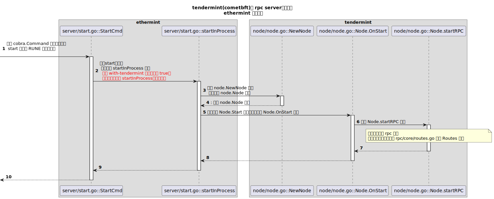

# rpcServer的启动流程



rpc 启动后，设置了它的路由：
```go
// startRPC 函数中
mux.HandleFunc("/websocket", wm.WebsocketHandler)
rpcserver.RegisterRPCFuncs(mux, rpccore.Routes, rpcLogger)
```
其中的 Routes 变量定义在 rpc/core/routes.go 中。它采用表格形式定义了 rpc 请求的所有处理函数：

| 路由 | 处理函数 | 处理函数定义位置 |
| ---- | ------ | ------- |
|broadcast_tx_sync | BroadcastTxSync | rpc/core/mempool.go |


