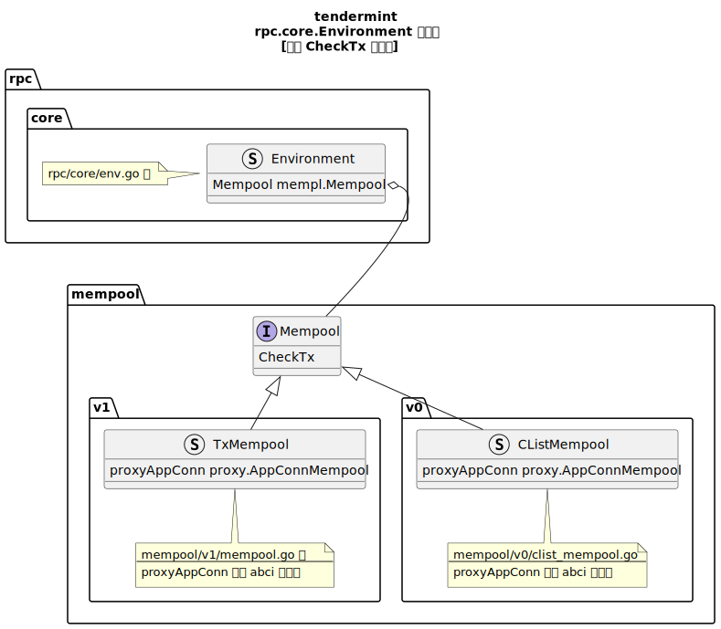

`rpc/core/mempool.go` 的 `BroadcastTxSync` 的逻辑：

1. 首先调用 `env.Mempool.CheckTx(…)` 对 Tx 进行检查
2. 等待检查结束后，将检查结果返回给调用者
3. 在 grpc-server 中，BroadcastTxSync 的检查结果会被返回给 rpc 的客户端。

`Mempool` 是一个接口，定义在 `mempool/mempool.go` 中，我们这里用到的 CheckTx 即是它的一个接口函数。

```go
// CheckTx executes a new transaction against the application to determine
// its validity and whether it should be added to the mempool.
CheckTx(tx types.Tx, callback func(*abci.Response), txInfo TxInfo) error
```

`Mempool` 的初始化是在 `node/node.go::NewNode` 中进行的（`node/node.go :: createMempoolAndMempoolReactor`）

`Mempool` 被集成在 `Environment` 结构体中。 `Environment` 的唯一实例就是  `rpc/core/env.go` 中的 `env` `变量。env` 变量的初始化在 `rpc-server` 启动时完成（`Node.ConfigRPC `函数中）。`Mempool`相关的类图如下图所示：


`Mempool` 的具体实例在创建时，会读取 `Config.toml` 中 `[mempool]` 节的配置；
其中的 `version` 字段决定了 `Mempool` 采用哪个实现类，（ethermint 默认的配置为 v0 ）
```

```
