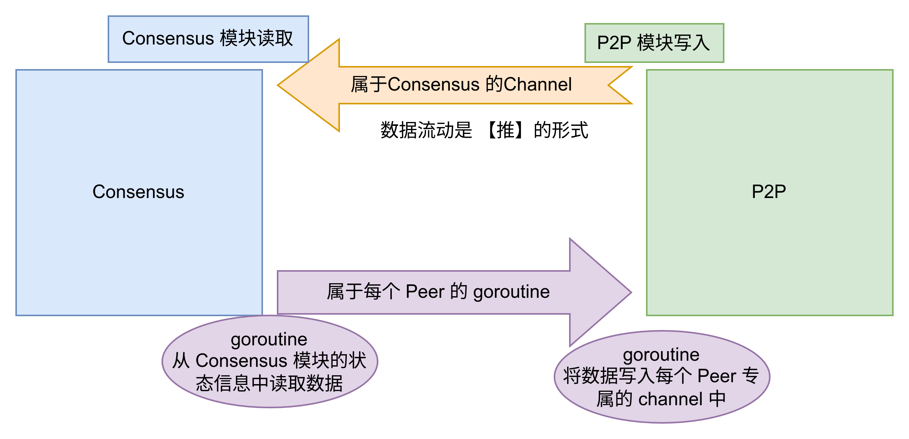

# 节点类型划分：

Tendermint的节点分为 全节点(full-node)和轻节点(light-node)两类。
全节点中, 节点持有的私钥在 active-validator 私钥集合中的节点，称为验证节点(validator-node)。
只有验证节点参数与区块生成的共识。

在创世配置文件中，可以设置初始的验证节点集合。
验证的变化（增加、删除）可以在上层的应用中决定。 应用层通过ABCI接口的 EndBlock 调用返回一个 “验证节点变更列表”，Tendermint据此调整Validator集合。

具体影响 Validator 集合的模块是 Cosmos-SDK中的 staking module 和 slashing module，这个在后面讲解 Cosmos-SDK 时会详细介绍。


# Consensus 和 P2P之间 的消息流转形式



## 从 P2P 到 Consensus 是推的方式

从p2p模块收到的数据，被写入channel，然后被consensus模块从channel中读取。

* 从P2P模块收到的消息被写入channel:

```go
// consensus/reactor.go 中 
func (conR *Reactor) ReceiveEnvelope(e p2p.Envelope) {
    // ...
    // 将消息写入 channel， 
    conR.conS.peerMsgQueue <- msgInfo{msg, e.Src.ID()}
    // ...
}
```

* Consensus 从 channel 中读取消息并处理：

```go
// consensus/state.go 中
func (cs *State) receiveRoutine(maxSteps int) {
    // ...
    case mi = <-cs.peerMsgQueue:
        cs.handleMsg(mi)
    // ...
}
```

## 从Consensus到P2P是拉的方式
和一个节点建立连接后，会创建几个2个向其发送消息的 goroutine:

```go
// consensus/reactor.go 中 
func (conR *Reactor) AddPeer(peer p2p.Peer) {
    //...

    // 和新 peer 通信的 goroutine
	// Begin routines for this peer.
	go conR.gossipDataRoutine(peer, peerState)
	go conR.gossipVotesRoutine(peer, peerState)
	go conR.queryMaj23Routine(peer, peerState)

    //...
}
```

在这2个 gossip* 的 goroutine 中，会从当前的共识状态中读取数据，然后发送给 peer。

```go
// consensus/reactor.go 中 
func (conR *Reactor) gossipVotesRoutine(peer p2p.Peer, ps *PeerState) {
    //... 
    for{
        // 这个 rs 即存储了当前节点的共识状态
        rs := conR.getRoundState()
        // 取出 lastCommit 的 vote 信息，发送给 peer
        ps.PickSendVote(rs.LastCommit)
    }
}
```


# Proposer 的选择
Proposer的选择算法基于 加权的 round-robin 算法。

Proposer的选择逻辑实现位置：
combetBFT工程中的 types/validator_set.go 文件中的 findProposer 函数。

# 生成 Proposal

生成 Proposal 的逻辑实现位置：
```go
func (cs *State) defaultDecideProposal(height int64, round int32)
```


# Prevote

* 收到 Proposal 时，仅记录

1. 收到 Proposal 时，我们才创建了 ProposalBlockParts
```go
func (cs *State) defaultSetProposal(proposal *types.Proposal) {
    //...
	if cs.ProposalBlockParts == nil {
		cs.ProposalBlockParts = types.NewPartSetFromHeader(proposal.BlockID.PartSetHeader)
	}
    //...
}
```
2. 收到 BlockPart 时，会检查 ProposalBlockParts 是否存在，如果不存在，则是错误
```go
func (cs *State) addProposalBlockPart(msg *BlockPartMessage, peerID p2p.ID) (added bool, err error) {
    //...
	if cs.ProposalBlockParts == nil {
		// ...
        // 如果不存在，返回错误
		return false, nil
	}

}
```
3. 以上2点合起来，约束了，节点必然先处理收到 Proposal 的场景


## round 值是在什么时候++的？
在 Tendermint 中没有「域转换」这个概念，取而代之的是 Round ，即「轮」。在每一个区块高度上，Proposal 总是从 Round 0 开始，即第 0 轮；如果这一轮数据没有被最终提交，则保持区块高度不变，进入到下一轮即 Round 1，直到成功，区块高度加 1 ，又从 Round 0 开始，周而复始。每进行一轮，Proposal 的提交者都会改变，这其实就是「域转换」


**发现一个很严重的情况我还没弄明白：enterPrecommit 函数的最后体现的情况：**
其它节点已经达成共识了，但是本节点没有该共识对应的区块；
(当前节点错过了 提案和区块的广播，但是却收到了 prevote消息，
它应该尽力去把区块拉取过来，但是，还没弄明白代码实现，它的代码使用了 eventBus, 
后面需要把 eventBus 的实现梳理清楚)

---

三阶段的共识

定位/选举 proposer

proposal
prevote
precommit

commit


---

validator 是如何加入网络的？


---

proposer 是如何选举的？

