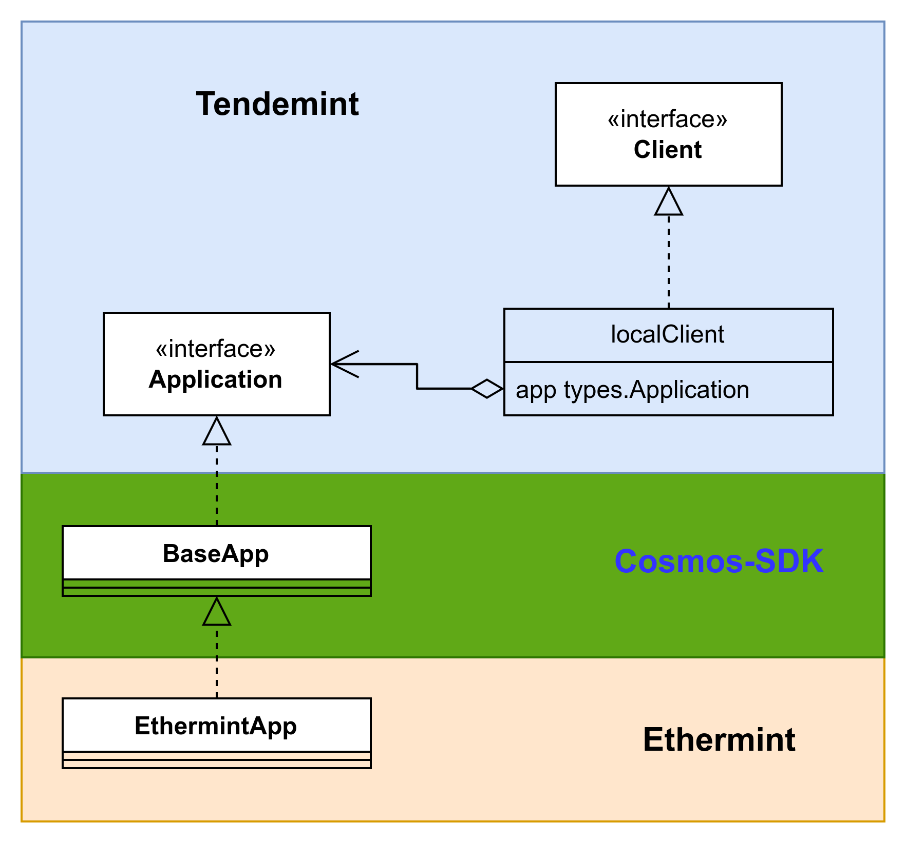

# 概述

BaseApp 在结构中的位置，



根据位置讲解一部分功能；

它还实现了 
路由机制；
存储机制；

这两个机制都和 ABCI 接口紧密相关；

# 路由机制

## Tx 的结构
说到路由机制，需要先说 Tx 的结构；
Tx 是由一组 Message 组成的； 一个 Message 代表一个模块的一个业务操作；
从 Tendermint 层传递给 CosmosSDK 的 Tx 是一个字节数组([]byte)；
它经过初步解码后，得到 TxRaw 结构，TxRaw 结构中包含了一组 Message 的字节数组([]byte)；
```go
type TxRaw struct {
	BodyBytes []byte `protobuf:"bytes,1,opt,name=body_bytes,json=bodyBytes,proto3" json:"body_bytes,omitempty"`

	AuthInfoBytes []byte `protobuf:"bytes,2,opt,name=auth_info_bytes,json=authInfoBytes,proto3" json:"auth_info_bytes,omitempty"`

	Signatures [][]byte `protobuf:"bytes,3,rep,name=signatures,proto3" json:"signatures,omitempty"`
}
```

Message 解码时，涉及一个重要的结构， interfaceRegistry；


## 路由机制的实现
```go
type moduleRouter struct {
	router           sdk.Router        // handle any kind of message
	queryRouter      sdk.QueryRouter   // router for redirecting query calls
	grpcQueryRouter  *GRPCQueryRouter  // router for redirecting gRPC query calls
	msgServiceRouter *MsgServiceRouter // router for redirecting Msg service messages
}

```

DeliverTx 时，体现在 BaseApp.runMsg 的详细流程中；

### 消息的 encode, decode

有一个名为  `interfaceRegistry` 的字段，它到底是用来干什么的？

#### 消息的编码
__以 `MsgEthereumTx` 为例__

```go
func (b *Backend) SendRawTransaction(data hexutil.Bytes) (common.Hash, error) {
	//...
	
}
```


提及消息的解码，就不得不提及交易 `tx` 的数据结构:
1. 从Tendermint层传上来时，tx 是一个字节数组([]byte)；


# 存储机制

分成2大块讨论，一块是存储的初始化，一块是运行时的存储；

## 初始化

建立主要数据结构之间的关系；

## 运行时

运行时又区分 查询 和 执行交际 这两种场景

### 查询

查询很简单，就是响应 ABCI.Query 的处理

### 执行交际

执行交易，则分为5步

1. check
2. beginBlock
3. deliverTx
4. endBlock
5. commit


BaseApp.checkState is set on InitChain and reset on Commit
BaseApp.deliverState is set on InitChain and BeginBlock and set to nil on Commit
