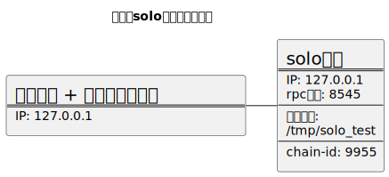

# 一、准备二进制程序

1. clone 代码

```bash
git clone https://github.com/evmos/ethermint.git
```

2. 从 `remotes/origin/release/v0.22.x` 分支创建本地分支
3. 为了有效的控制后续的代码调试，需要将 `cosmos-sdk` 和 `tendermint` 替换为本地代码。这需要修改 `go.mod` 文件，将原来的依赖替换为本地依赖。在`go.mod`文件后新增如下内容：

```go
// 将依赖修改为本地依赖
replace (
	github.com/cosmos/cosmos-sdk => /home/gk/Workspace/01.projects/010.project.research/010.ne.cosmos/03.cosmos.workspace/cosmos-sdk/cosmos-sdk
	github.com/tendermint/tendermint => /home/gk/Workspace/01.projects/010.project.research/010.ne.cosmos/03.cosmos.workspace/cometbft
)
```

4. 在 `ethermint` 目录下执行 `make build` 命令，将在 `ethermint/build` 目录下生成 `ethermintd` ,将其拷贝到测试机器上即可使用。

# 二、单节点模式调试(solo模式)
使用单节点模式主要用于调试abci接口。



1. 在目标机器（10.221.51.153）上创建 `/home/gk/ethermint` 目录，并将其加入到环境变量中。
2. 将生成的 `ethermintd` 拷贝到目标机器的 `/home/gk/ethermint` 目录下。
3. 将 scripts/solo_init_config.sh 拷贝到目标机器的 `/home/gk/ethermint` 目录下。
4. 在目标机器上执行 `solo_init_config.sh` 脚本(位于 `scripts/solo_mode` 目录下)，生成 solo 节点的初始配置文件。
5. 执行如下命令，导出私钥，留作后面测试用：

```bash
WORK_DIR=$HOME/ethermint/solo_dir
KEY=solo_mykey

ethermintd keys export ${KEY} --unsafe --unarmored-hex  --home ${WORK_DIR}
```
6. 使用如下命令启动 `ethermintd` 节点：

```bash
WORK_DIR=$HOME/ethermint/solo_dir

LOGLEVEL="info"
# trace evm
TRACE="--trace"

ethermintd start --metrics --pruning=nothing --evm.tracer=json $TRACE --log_level $LOGLEVEL --minimum-gas-prices=0.0001aphoton --json-rpc.api eth,txpool,personal,net,debug,web3,miner --api.enable  --home ${WORK_DIR}
```
